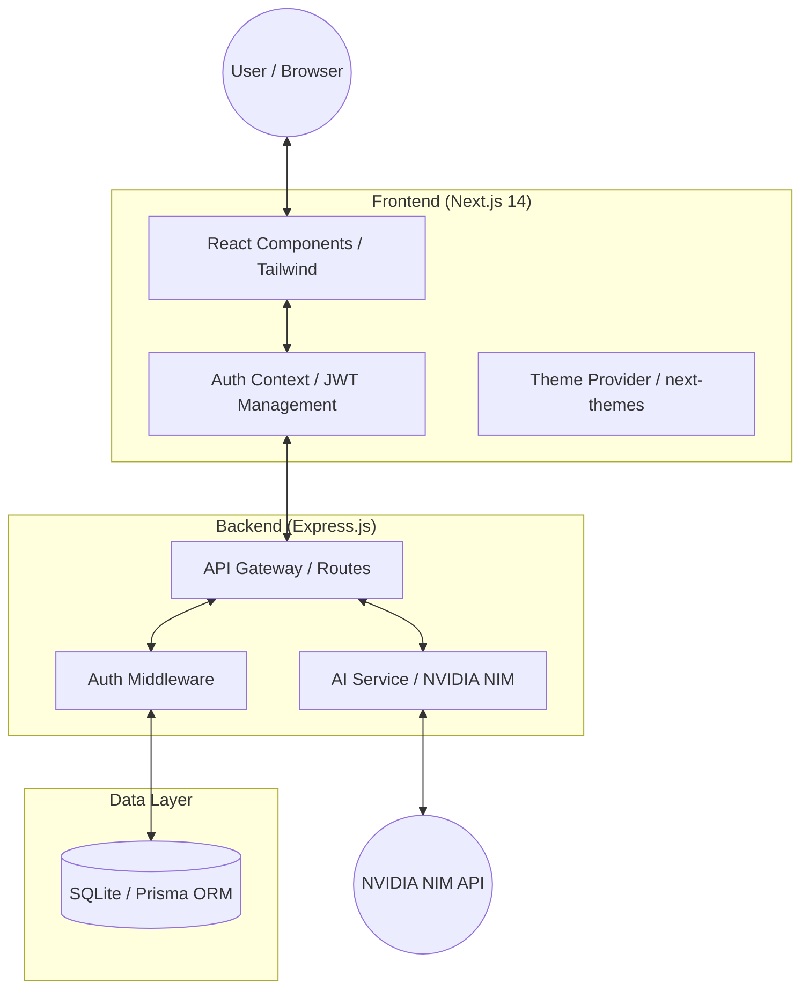

# Peblo Notes

Peblo Notes is a professional, minimalist, AI-powered collaborative notes workspace. It allows users to securely capture ideas, organize them with tags, share notes publicly, and leverage state-of-the-art AI models to instantly generate summaries and actionable items.

## 🌟 Key Features

- **Dual-Theme Experience**: A premium interface supporting both **Dark Mode** (Linear-style minimalist) and **Light Mode** (Clean, professional zinc aesthetic) with a seamless toggle.
- **AI-Powered Insights**: Native integration with NVIDIA NIM (`meta/llama-3.3-70b-instruct`) to generate instant summaries and structured action items.
- **Organization & Search**: Advanced tagging system with real-time search filtering across titles, content, and tags.
- **Secure Authentication**: Robust JWT-based authentication for user registration, login, and protected workspace routes.
- **Public Sharing**: Generate unique, secure links to share read-only versions of notes with a high-end typography layout.
- **Productivity Dashboard**: Visual analytics using Recharts to track note-taking trends and activity.

---

## 🏗️ System Architecture

Peblo Notes follows a modern decoupled architecture, ensuring scalability and a clean separation of concerns.

### Architecture Diagram


### Technical Flow
1. **Authentication**: Users authenticate via JWT. The token is stored locally and sent in the `Authorization` header for all protected API requests.
2. **AI Processing**: When a user requests "Insights," the Backend retrieves the note content from the SQLite database and sends it to the **NVIDIA NIM** service (Llama 3.3). The structured response (Summary/Action Items) is then persisted back to the database.
3. **Data Persistence**: Prisma ORM acts as a type-safe bridge between the Express server and the SQLite database, ensuring consistent data models.
4. **Theming**: `next-themes` manages the `dark` class on the HTML body, allowing Tailwind's `dark:` modifiers to toggle styles instantly without page reloads.

---

## 🛠️ Tech Stack

- **Frontend**: Next.js 14, TypeScript, Tailwind CSS, Lucide Icons, Recharts.
- **Backend**: Node.js, Express.js, Prisma ORM, SQLite.
- **AI Integration**: NVIDIA NIM API (Llama 3.3-70B).

---

## 🚀 Setup Instructions

### 1. Prerequisites
- Node.js (v18+)
- npm

### 2. Configure Environment Variables
**Backend (`backend/.env`):**
```env
DATABASE_URL="file:./dev.db"
JWT_SECRET="your_secret_key"
NVIDIA_NIM_API_KEY="your_nvidia_api_key"
```

**Frontend (`frontend/.env.local`):**
```env
NEXT_PUBLIC_API_URL="http://localhost:5000/api"
```

### 3. Installation & Running
```bash
# Setup Backend
cd backend && npm install
npx prisma db push
node src/index.js

# Setup Frontend (Separate Terminal)
cd frontend && npm install
npm run dev
```

Navigate to `http://localhost:3000`.

---

## 🧪 Testing
1. **Theme Toggle**: Test the Sun/Moon icon in the sidebar.
2. **AI Processing**: Click "Generate Insights" to verify Llama 3.3 parsing.
3. **Public View**: Share a note and open the link in incognito mode.
